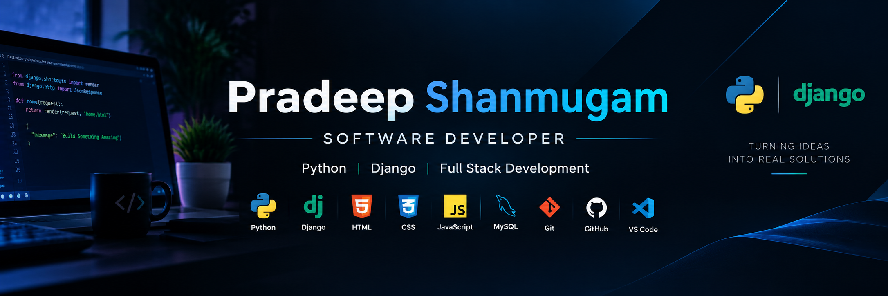

  

<h2>👋 Hi, I'm Pradeep Shanmugam</h2>

<h3>💻 Software Developer | 🐍 Python & Django | 🌐 Full-Stack Development</h3>

  

## 👨‍💻 About Me

I'm a **Software Developer** and **Python & Django Full-Stack Developer** with a strong interest in building practical, database-driven web applications.

I enjoy turning ideas into real-world software using **Python, Django, MySQL, JavaScript, HTML, CSS, and Bootstrap**.

I'm particularly interested in backend development, web application architecture, authentication systems, databases, APIs, and building useful developer-focused applications.

* 💻 Software Development
* 🐍 Python & Django Development
* 🌐 Full-Stack Web Development
* 🗄️ MySQL & Database-Driven Applications
* 🔐 Authentication & User Management
* 🔌 Backend & API Development
* 🎨 HTML, CSS, JavaScript & Bootstrap
* 🚀 Building Real-World Projects
* 📚 Continuously Learning & Improving

---

## 🛠️ Tech Stack

---

# 🚀 Featured Projects

## 🐍 DarkCoderz — Coding Practice Platform

**Python • Django • MySQL • HTML • CSS • JavaScript • Bootstrap 5**

A full-stack **Django coding practice platform** designed to help developers **Practice, Debug, and Visualize** their programming skills.

### ✨ Features

* 🧩 **DSA Challenges** — Solve coding problems and earn points
* 🐛 **Debug Challenges** — Find and fix bugs in broken code
* 🧠 **Tricky Questions** — Test programming logic with code-output questions
* 🔥 **Daily Streaks** — Track consistency and maintain coding streaks
* 🏆 **Leaderboard** — Compete with developers based on points and solved problems
* 📊 **Progress Dashboard** — Track solved problems, points, and streak performance
* 🔍 **Visual Code Explainer** — Understand code execution step-by-step
* 📄 **AI Resume Rewriter** — Tailor resume wording toward job descriptions without inventing skills
* 🔐 **Authentication** — User registration, login, and protected features

### 🧱 Built With

`Python` `Django` `MySQL` `HTML` `CSS` `JavaScript` `Bootstrap 5`

---

## 🍔 Crave Corner — Food Delivery Web App

**HTML • CSS • JavaScript • Bootstrap 5**

A responsive multi-page food ordering application with a complete browsing and ordering flow.

### ✨ Features

* 🔐 User login interface
* 🍕 Dynamic menu browsing
* 🛒 Cart-based ordering
* 📦 Order history and view-order system
* 💾 `localStorage` for persistent cart and order data
* 🌙 Dark/Light theme
* 🔔 Bootstrap Toast notifications
* ✨ AOS scroll animations
* 📱 Responsive Bootstrap 5 design

---

## 🇮🇳 Viduthalai — India's Freedom Struggle Web Archive

**HTML • CSS • JavaScript • Bootstrap 5**

A multi-page educational web archive documenting India's freedom struggle, important historical personalities, major events, and India's achievements after independence.

### ✨ Features

* 🇮🇳 Information about freedom fighters
* 📜 Freedom struggle timeline
* 🏛️ India's post-independence achievements
* 👨‍💼 Presidents and Prime Ministers archive
* 🎨 Dark navy and gold UI
* 📱 Responsive design
* 🧭 Multi-page Bootstrap navigation

---

## 🏦 Bank Management System

**Python • OOP • Exception Handling**

A command-line banking application developed using Object-Oriented Programming principles.

### ✨ Features

* 👤 Account creation
* 💰 Deposits
* 💸 Withdrawals
* 🔄 Fund transfers
* 🧱 Class-based account management
* 🛡️ Exception handling
* ⚖️ Balance and transaction validation

---

## 🎓 Student Management System

**Python • Dictionaries • File Handling • Exception Handling**

A console-based application for managing student records.

### ✨ Features

* ➕ Add students
* ✏️ Update students
* 🔍 Search students
* 🗑️ Delete students
* 💾 File-based data persistence
* 🛡️ Input validation
* ⚠️ Exception handling

---

# 📜 Certifications

* 🎓 **AI For Everyone** — Coursera
* 📊 **Introduction to Microsoft Excel** — Coursera
* ⚡ **Embedded System Using C** — Coursera
* 🤖 **Blue Prism Associate Developer** — EduSkill

---

# 🎯 Career Goal

I'm currently seeking an **entry-level Software Developer / Python Full-Stack Developer** opportunity where I can:

* 💻 Build real-world software applications
* 🐍 Apply my Python and Django skills
* 🗄️ Work with databases and APIs
* 🤝 Learn from experienced developers
* 🚀 Contribute to meaningful projects
* 📈 Grow as a software professional

---

# 📊 GitHub Stats

---

# 🔥 GitHub Streak

---

# 🤝 Connect With Me

---

### 🚀 Code • Learn • Build • Grow

 

  

