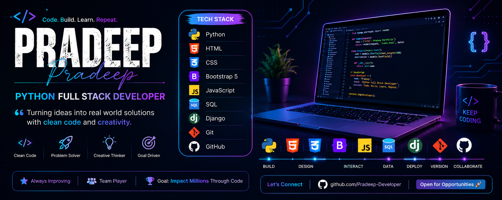

  

<h2>👋 Hi, I'm Pradeep Shanmugam</h2>

<h3>💻 Software Developer | 🐍 Python & Django | 🌐 Full-Stack Development</h3>

 

  

---

## 👨‍💻 About Me

I'm a **Software Developer** focused on **Python, Django, and Full-Stack Web Development**.

I enjoy turning ideas into practical, database-driven applications with clean interfaces, reliable backend logic, authentication systems, APIs, and real-world workflows.

My current development focus includes:

* 💻 Software Development
* 🐍 Python & Django
* 🌐 Full-Stack Web Development
* 🗄️ MySQL & Database-Driven Applications
* 🔐 Authentication & User Management
* 🔌 Backend Development & APIs
* 🎨 HTML, CSS, JavaScript & Bootstrap
* 🤖 AI-Powered Applications
* 🚀 Building Real-World Projects
* 📚 Continuous Learning

---

## 🛠️ Tech Stack

---

# 🚀 Featured Projects

## 🐍 DarkCoderz — Coding Practice Platform

**Python • Django • MySQL • HTML • CSS • JavaScript • Bootstrap 5**

A full-stack **Django coding practice platform** designed to help developers **Practice, Debug, and Visualize** their programming skills.

### ✨ Features

* 🧩 **DSA Challenges** — Solve coding problems and earn points
* 🐛 **Debug Challenges** — Find and fix bugs in broken code
* 🧠 **Tricky Questions** — Test programming logic with code-output questions
* 🔥 **Daily Streaks** — Track consistency and maintain coding streaks
* 🏆 **Leaderboard** — Compete with developers based on points and solved problems
* 📊 **Progress Dashboard** — Track solved problems, points, and streak performance
* 🔍 **Visual Code Explainer** — Understand code execution step-by-step
* 📄 **AI Resume Rewriter** — Tailor resume wording toward job descriptions without inventing skills
* 🔐 **Authentication** — User registration, login, and protected features

### 🧱 Built With

`Python` `Django` `MySQL` `HTML` `CSS` `JavaScript` `Bootstrap 5`

---

## 📧 ColdMail AI — AI Cold Email Generator

**Python • Django • MySQL • AI APIs • Google OAuth2 • JavaScript**

A full-stack Django application that helps job seekers **generate, refine, evaluate, and send personalized cold emails** while managing outreach from a centralized dashboard.

### ✨ Features

* 🤖 **AI Email Generation** — Generate personalized cold emails using multiple AI providers
* 🔄 **AI Fallback System** — Multiple AI providers and template fallbacks improve reliability
* 💬 **AI Email Assistant** — Refine and improve emails through conversational interaction
* 🛡️ **Scam & Phishing Detection** — Analyze recruiter emails for suspicious patterns
* 🧠 **Domain-Level Learning** — Improve scam detection using learned domain information
* 📬 **Gmail OAuth2 Integration** — Send emails and interact with Gmail securely
* 📊 **Application Tracker** — Track stages such as Sent, Replied, Interview, and Offer
* 🔐 **Authentication & Profiles** — Custom user authentication and profile management

### 🧱 Built With

`Django` `Python` `MySQL` `Gemini API` `Groq` `OpenRouter` `Mistral` `Google OAuth2` `JavaScript` `HTML` `CSS`

---

## 🍔 Crave Corner — Food Delivery Web App

**HTML • CSS • JavaScript • Bootstrap 5**

A responsive multi-page food ordering application with a complete browsing and ordering flow.

### ✨ Features

* 🔐 User login interface
* 🍕 Dynamic menu browsing
* 🛒 Cart-based ordering
* 📦 Order history and view-order system
* 💾 `localStorage` for persistent cart and order data
* 🌙 Dark/Light theme
* 🔔 Bootstrap Toast notifications
* ✨ AOS scroll animations
* 📱 Responsive Bootstrap 5 design

---

## 🇮🇳 Viduthalai — India's Freedom Struggle Web Archive

**HTML • CSS • JavaScript • Bootstrap 5**

A multi-page educational web archive documenting India's freedom struggle, important historical personalities, major events, and India's achievements after independence.

### ✨ Features

* 🇮🇳 Freedom fighter archive
* 📜 Freedom struggle timeline
* 🏛️ India's post-independence achievements
* 👨‍💼 Leaders archive
* 🎨 Dark navy and gold interface
* 📱 Responsive design
* 🧭 Multi-page Bootstrap navigation

---

## 🏦 Bank Management System

**Python • OOP • Exception Handling**

A command-line banking application developed using Object-Oriented Programming principles.

### ✨ Features

* 👤 Account creation
* 💰 Deposits
* 💸 Withdrawals
* 🔄 Fund transfers
* 🧱 Class-based account management
* 🛡️ Exception handling
* ⚖️ Balance and transaction validation

---

## 🎓 Student Management System

**Python • Dictionaries • File Handling • Exception Handling**

A console-based application for managing student records.

### ✨ Features

* ➕ Add students
* ✏️ Update students
* 🔍 Search students
* 🗑️ Delete students
* 💾 File-based data persistence
* 🛡️ Input validation
* ⚠️ Exception handling

---

# 📜 Certifications

* 🎓 **AI For Everyone** — Coursera
* 📊 **Introduction to Microsoft Excel** — Coursera
* ⚡ **Embedded System Using C** — Coursera
* 🤖 **Blue Prism Associate Developer** — EduSkill

---

# 🎯 Career Focus

I'm currently looking for an **entry-level Software Developer / Python Full-Stack Developer** opportunity where I can contribute to real-world applications and continue growing as a software professional.

### What I'm looking to work with

* 🐍 Python & Django
* 🌐 Full-Stack Web Applications
* 🗄️ MySQL & Databases
* 🔌 REST APIs & Backend Systems
* 🔐 Authentication & Application Security
* 🤖 AI-Integrated Applications
* 🤝 Collaborative Software Development

---

# 📊 GitHub Activity

---

# 🔥 Contribution Streak

---

# 🤝 Let's Connect

 

### 💻 Building software that solves real problems.

**Python • Django • MySQL • JavaScript • Full-Stack Development**

 

> 🚀 Learn. Build. Debug. Improve. Repeat.

---

### 👋 Thanks for visiting my profile!

If you find my projects interesting, feel free to explore the repositories and connect with me.

 

**⭐ Keep building. Keep learning. Keep growing.**

